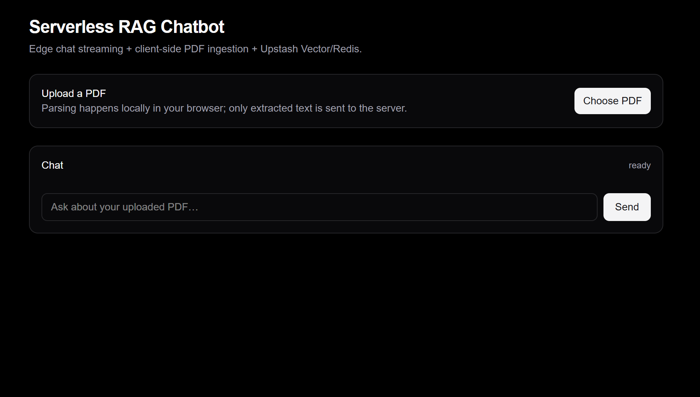
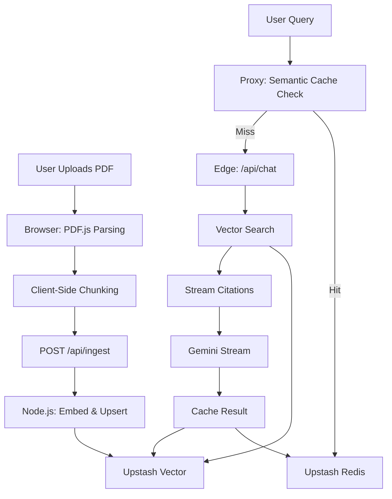

# Serverless RAG Chatbot

> **Scale-to-Zero RAG Architecture** — A production-ready RAG chatbot that costs **$0/month when idle** and scales instantly. Built with Next.js 16, Gemini, and Upstash.


[](https://nextjs.org)
[](https://www.typescriptlang.org)
[](https://ai-sdk.dev)
[](https://ai.google.dev)
[](https://upstash.com)



> **Note**: This is the first iteration (v1.0) focused on PDF document Q&A. Future versions will expand to support multiple file formats (Word, Markdown, text files), web scraping, and more advanced RAG capabilities.

## Features

- **True Scale-to-Zero**: No monthly minimums (unlike Pinecone's $50 floor) — pay only for what you use
- **Edge-Optimized**: Chat runs on Vercel Edge with sub-50ms cold starts
- **Client-Side PDF Parsing**: Parse PDFs in the browser to avoid Edge runtime limits
- **Semantic Caching**: 30-60% cost reduction via intelligent query caching
- **Streaming Citations**: Citations stream before the answer for instant transparency
- **Hybrid Runtime**: Edge for chat, Node.js for ingestion (optimal performance)
- **Modern UI**: Beautiful, responsive chat interface with real-time streaming

## Architecture



## Quick Start

### Prerequisites

- Node.js 18+ 
- npm or yarn
- Upstash Vector & Redis accounts (free tier available)
- Google Gemini API key

### Installation

1. **Clone the repository**
   ```bash
   git clone https://github.com/yourusername/serverless-rag-chatbot.git
   cd serverless-rag-chatbot
   ```

2. **Install dependencies**
   ```bash
   npm install
   ```

3. **Create Upstash Vector Index with Built-in Embedding**
   
   Go to [Upstash Console](https://console.upstash.com/) → Vector → Create Index:
   - **Name**: `serverless-rag` (or your choice)
   - **Region**: Choose closest to your users
   - **Embedding Model**: Select `BAAI/bge-base-en-v1.5` (768 dimensions, FREE!)
   
   > ⚠️ **Important**: You MUST select an embedding model when creating the index. This enables Upstash's built-in embedding, which is FREE and avoids external API quotas!

4. **Set up environment variables**
   ```bash
   cp env.example .env.local
   ```
   
   Fill in your `.env.local`:
   ```env
   GOOGLE_GENERATIVE_AI_API_KEY=your_gemini_api_key
   UPSTASH_REDIS_REST_URL=your_redis_url
   UPSTASH_REDIS_REST_TOKEN=your_redis_token
   UPSTASH_VECTOR_REST_URL=your_vector_url
   UPSTASH_VECTOR_REST_TOKEN=your_vector_token
   ```

5. **Run the development server**
   ```bash
   npm run dev
   ```

6. **Open [http://localhost:3000](http://localhost:3000)**

## How It Works

### 1. PDF Ingestion (Client-Side)

- User uploads a PDF via the browser UI
- **PDF.js** (loaded from `public/pdf.worker.min.mjs`) extracts text page-by-page
- Text is chunked locally (900 chars, 150 overlap) and sent as JSON to `/api/ingest`
- **Upstash Vector's built-in embedding** handles embeddings (FREE - no external API calls!)

### 2. Chat Flow

**Semantic Cache (Fast Path):**
- `src/proxy.ts` intercepts `/api/chat` requests
- Uses Upstash Vector's built-in embedding to search for similar cached queries (threshold: 0.95)
- If found, returns cached answer from Upstash Redis instantly

**RAG Pipeline (Cache Miss):**
- Uses Upstash's built-in embedding → searches Upstash Vector (Top-K=8)
- **Streams citations first** (custom `data-citations` part)
- Streams Gemini answer via Server-Sent Events
- Caches result for future similar queries

### 3. UI Components

- **`PdfUploader`**: Client-side PDF parsing with progress indicators
- **`Sources`**: Real-time citation display with document sources
- **Chat Interface**: Streaming messages with `@ai-sdk/react` hooks

## Tech Stack

| Component | Technology | Why |
|-----------|-----------|-----|
| **Framework** | Next.js 16 (App Router) | Native Edge support, React Server Components |
| **LLM** | Google Gemini (configurable) | Default: `gemini-2.5-flash` (free tier, 10 RPM/250 RPD) |
| **Embeddings** | Upstash Vector (built-in) | FREE! Uses `BAAI/bge-base-en-v1.5` - no external API costs |
| **Vector DB** | Upstash Vector | True scale-to-zero, HTTP-native |
| **Cache** | Upstash Redis | Semantic caching for cost reduction |
| **PDF Parsing** | `pdfjs-dist` | Client-side to avoid Edge limits |
| **UI** | React + `@ai-sdk/react` | Streaming chat with citation support |

## Project Structure

```
serverless-rag/
├── src/
│   ├── app/
│   │   ├── api/
│   │   │   ├── chat/route.ts      # Edge chat route (streaming)
│   │   │   └── ingest/route.ts     # Node.js ingestion route
│   │   ├── components/
│   │   │   ├── PdfUploader.tsx    # Client-side PDF parsing
│   │   │   └── Sources.tsx        # Citation display
│   │   └── page.tsx               # Main chat UI
│   ├── lib/
│   │   ├── chunking.ts            # Text chunking utilities
│   │   ├── retrieval.ts           # Vector search & cache logic
│   │   └── upstash.ts             # Upstash client initialization
│   └── proxy.ts                   # Semantic cache proxy
├── public/
│   └── pdf.worker.min.mjs         # PDF.js worker (static asset)
└── env.example                    # Environment variable template
```

## Key Design Decisions

### Why Gemini 2.0 Flash by Default?

**The Scale-to-Zero Constraint:**
The project's core value proposition is "$0/month when idle." This dictates every architectural decision, including model choice.

- **Cost Efficiency**: At $0.10 per 1M input tokens vs $1.25 for Pro (12.5x cheaper), Flash models align with our scale-to-zero philosophy
- **Speed**: Lower latency is crucial for streaming chat experiences
- **RAG Sufficiency**: In RAG pipelines, intelligence is split between retrieval (Upstash Vector) and synthesis (LLM). Flash excels at synthesis, it doesn't need to know everything; it just needs to read retrieved chunks and summarize them effectively
- **Massive Context Window**: 1M tokens means you can feed significantly more retrieved chunks, reducing the risk of missing information

### Why Client-Side PDF Parsing?

- **Edge Runtime Limits**: Vercel Edge has 1MB bundle size limits and strict CPU time constraints
- **Cost Efficiency**: Offloads parsing to user's browser (zero server cost)
- **Reliability**: Avoids "Module not found: fs" errors common in serverless RAG apps

### Why Upstash Over Pinecone?

- **True Scale-to-Zero**: No $50/month minimum (Pinecone Serverless has a floor)
- **HTTP-Native**: No gRPC connection issues in Edge environments
- **Lower Latency**: P99 latencies in 26-50ms range

### Why Hybrid Runtime?

- **Edge for Chat**: Sub-50ms cold starts, perfect for streaming responses
- **Node.js for Ingestion**: Larger bundle sizes, better for batch embedding operations

## Deployment

### Deploy to Vercel

1. Push your code to GitHub
2. Import project in [Vercel](https://vercel.com/new)
3. Add environment variables in Vercel dashboard
4. Deploy!

The app will automatically:
- Use Edge runtime for `/api/chat`
- Use Node.js runtime for `/api/ingest`
- Serve static assets (including PDF.js worker) from CDN

## Cost Analysis

### Idle State (0 Users)
- **Vercel**: $0 (Hobby plan)
- **Upstash Vector**: $0 (no requests)
- **Upstash Redis**: $0 (no requests)
- **Total**: **$0.00/month** 

### Hobbyist Scale (10k queries/month)
- **Vercel**: $0 (within free tier)
- **Upstash Vector**: ~$0.40 (10k requests)
- **Upstash Redis**: ~$0.20 (10k requests)
- **LLM**: ~$10-30 (Gemini usage)
- **Total**: **~$10-30/month**

Compare this to a containerized setup: **$24-200/month** (always-on servers)

## Contributing

Contributions are welcome! Please feel free to submit a Pull Request.

1. Fork the repository
2. Create your feature branch (`git checkout -b feature/AmazingFeature`)
3. Commit your changes (`git commit -m 'Add some AmazingFeature'`)
4. Push to the branch (`git push origin feature/AmazingFeature`)
5. Open a Pull Request

## License

This project is licensed under the MIT License - see the [LICENSE](LICENSE) file for details.

## Acknowledgments

- [Vercel AI SDK](https://ai-sdk.dev) for the excellent streaming primitives
- [Upstash](https://upstash.com) for true serverless infrastructure
- [PDF.js](https://mozilla.github.io/pdf.js/) for client-side PDF parsing
- The Next.js team for Edge runtime support

## Star History

If this project helped you, please consider giving it a star! ⭐

---

**Built with ❤️ for the serverless community**
